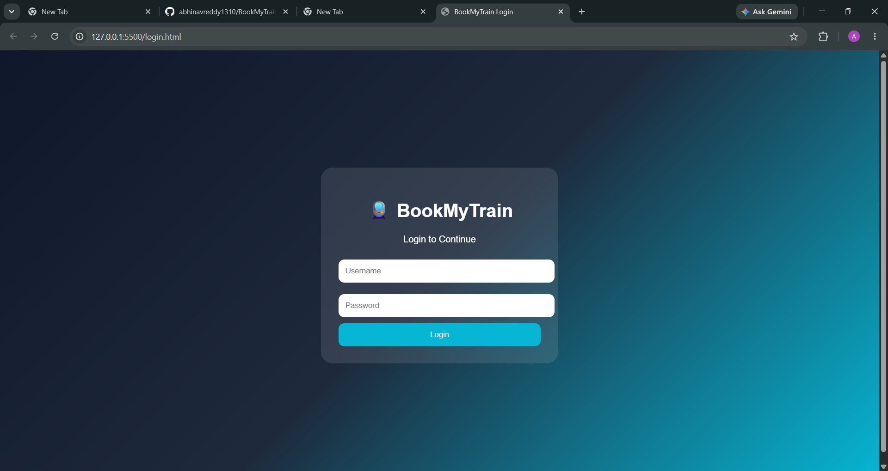
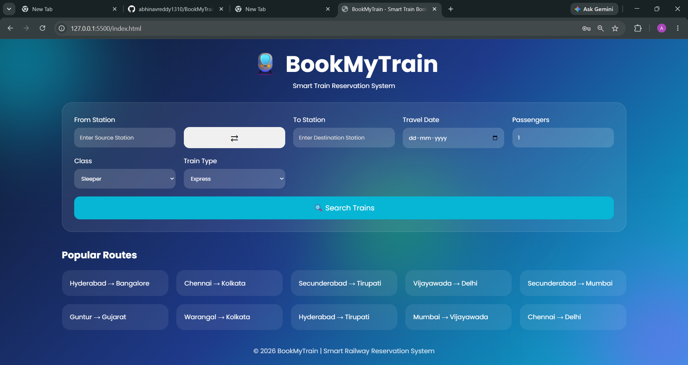
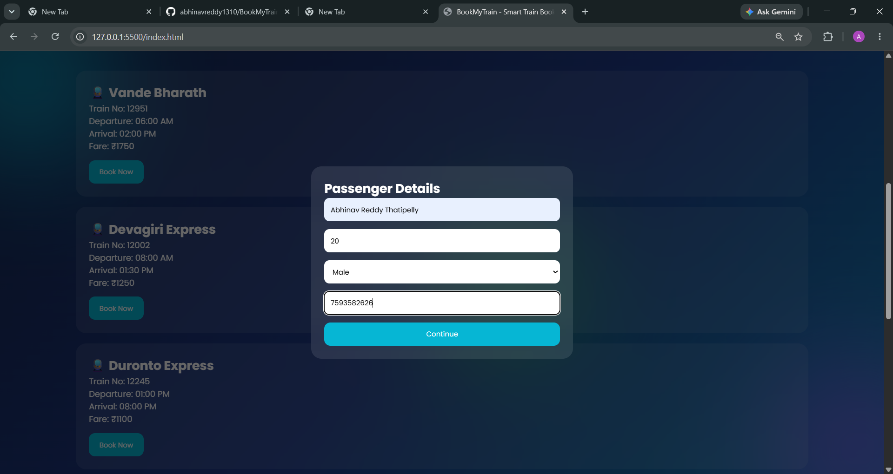
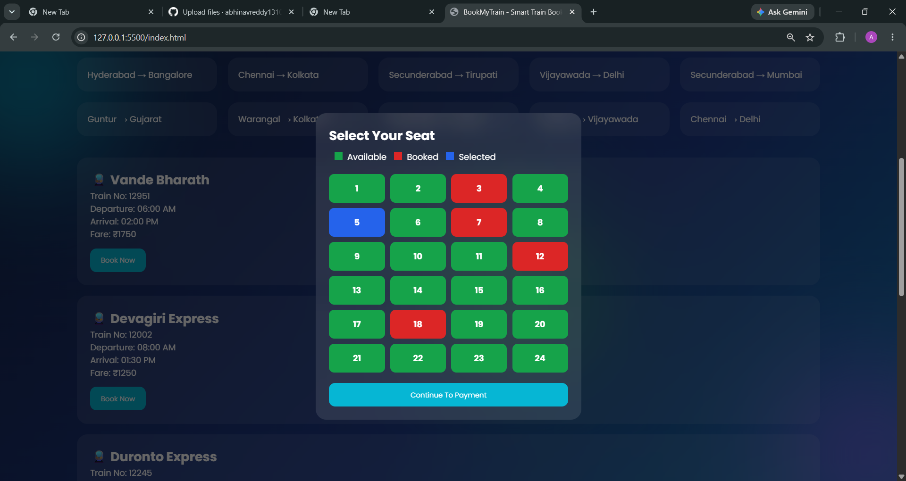
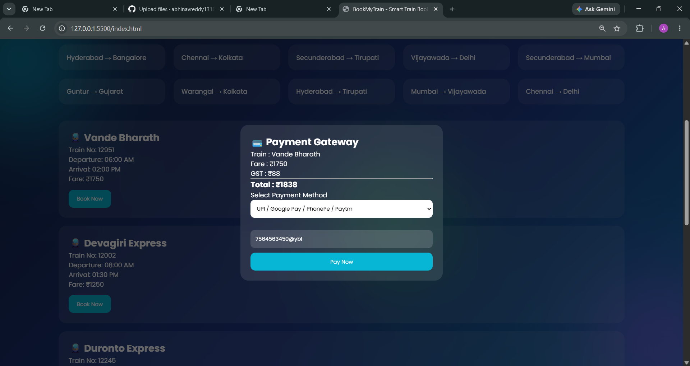
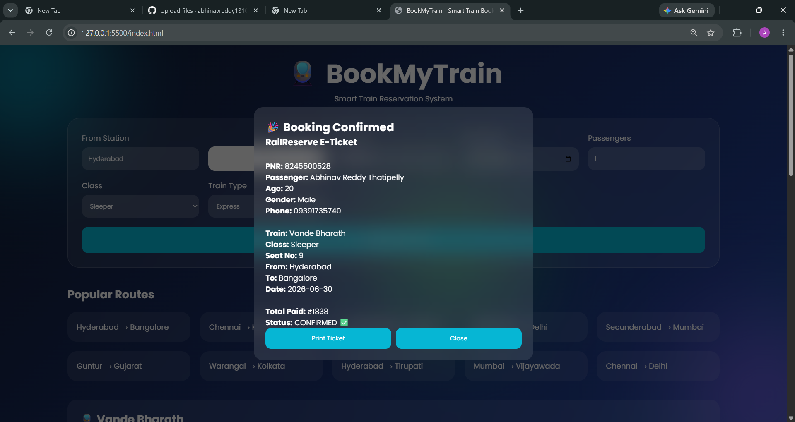

# 🚆 BookMyTrain

BookMyTrain is a simple Train Reservation System developed using **HTML, CSS, and JavaScript**. This project was created to simulate the basic train ticket booking process with a clean and responsive user interface.

## Features

- User Login
- Search trains by source and destination
- Select travel date and class
- View available trains
- Enter passenger details
- Choose available seats
- Simulated payment gateway
- Booking confirmation with PNR number
- Responsive design

## Technologies Used

- HTML5
- CSS3
- JavaScript

## Project Screenshots

### Login Page

---

### Home Page

---

### Passenger Details

---

### Seat Selection

---

### Payment Page

---

### Booking Confirmation

---

## How to Run

1. Download or clone this repository.
2. Open the project folder.
3. Open **login.html** in your web browser.
4. Login and start booking a train.

## Future Improvements

- Add backend using Java or Node.js
- Store booking details in a database
- User registration and authentication
- Online payment integration
- Live train information

## Author

**Abhinav Reddy**

GitHub: https://github.com/abhinavreddy1310
